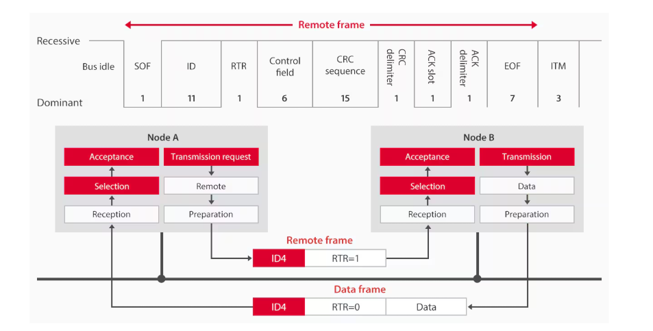
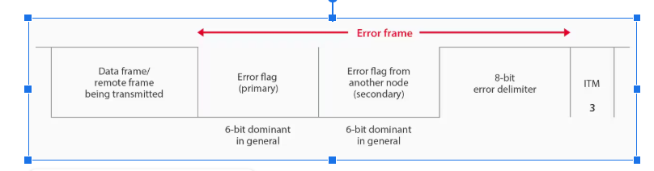
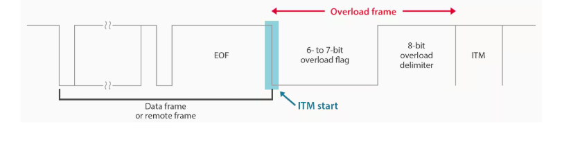
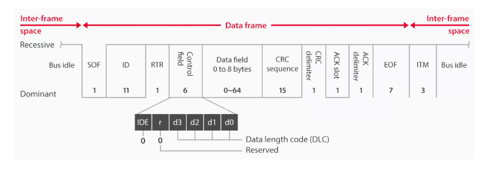

# STM32F103 CAN Communication with DMA

## Mô tả dự án (Project Description)

Dự án này minh họa việc truyền thông CAN liên tục trên vi điều khiển STM32F103C8T6 sử dụng thư viện SPL (Standard Peripheral Library). Hệ thống thực hiện:

- **CAN Loopback Mode**: Gửi và nhận dữ liệu CAN trong chế độ loopback để kiểm tra
- **DMA Transfer**: Sử dụng DMA để tự động truyền dữ liệu từ CAN đến UART
- **UART Display**: Hiển thị dữ liệu CAN qua UART với định dạng có thể đọc được

This project demonstrates continuous CAN communication on STM32F103C8T6 microcontroller using SPL (Standard Peripheral Library). The system performs:

- **CAN Loopback Mode**: Send and receive CAN data in loopback mode for testing
- **DMA Transfer**: Use DMA to automatically transfer data from CAN to UART
- **UART Display**: Display CAN data via UART in readable format

## Cấu hình phần cứng (Hardware Configuration)

### STM32F103C8T6 Blue Pill
- **System Clock**: 72MHz
- **CAN Interface**: 
  - PB8: CAN_RX (Input Pull-up)
  - PB9: CAN_TX (Alternate Function Push-Pull)
- **UART Interface**:
  - PA9: USART1_TX (Alternate Function Push-Pull) 
  - PA10: USART1_RX (Input Floating)

### CAN Configuration
- **Mode**: Loopback (for self-testing)
- **Baudrate**: ~1Mbps
- **APB1 Clock**: 36MHz
- **Bit Timing**: 
  - SJW: 1tq
  - BS1: 8tq
  - BS2: 1tq
  - Prescaler: 4

### UART Configuration
- **Baudrate**: 115200 bps
- **Data bits**: 8
- **Stop bits**: 1
- **Parity**: None
- **Flow control**: None

### DMA Configuration
- **DMA1_Channel4**: USART1_TX (Memory to Peripheral)
- **Transfer Mode**: Normal (not circular)
- **Data Size**: 8-bit
- **Priority**: High

## Kiến trúc phần mềm (Software Architecture)

### Luồng xử lý chính (Main Processing Flow)

```
1. System Initialization (72MHz)
2. DMA Configuration for UART TX
3. UART Configuration (115200 bps)
4. CAN Configuration (Loopback mode)
5. Main Loop:
   ├── Send CAN Message (incrementing data)
   ├── Wait for CAN Reception (interrupt-based)
   ├── Format received data for UART
   ├── Start DMA transfer to UART
   └── Delay before next transmission
```

### Interrupt Handlers

#### CAN1_RX0_IRQHandler()
- **Trigger**: CAN FIFO0 message pending
- **Function**: 
  - Receive CAN message from FIFO
  - Copy data to buffer
  - Set data ready flag
  - Clear interrupt

#### DMA1_Channel4_IRQHandler()
- **Trigger**: DMA transfer complete
- **Function**:
  - Clear DMA busy flag
  - Allow next transmission

### Memory Buffers

```c
uint8_t can_rx_buffer[8];      // CAN received data buffer
uint8_t uart_tx_buffer[20];    // UART transmission buffer (formatted)
volatile uint8_t can_data_ready;  // New data available flag
volatile uint8_t uart_dma_busy;   // DMA transmission busy flag
```

## Định dạng dữ liệu UART (UART Data Format)

Dữ liệu CAN được hiển thị qua UART theo định dạng:

```
MSG:XXXX DATA:AA BB CC DD EE FF 11 22\r\n
```

Trong đó:
- `MSG:XXXX`: Số thứ tự tin nhắn (hex, 4 chữ số)
- `DATA:`: Header cho dữ liệu
- `AA BB CC DD EE FF 11 22`: 8 bytes dữ liệu CAN (hex format)
- `\r\n`: Kết thúc dòng

Ví dụ: `MSG:0001 DATA:00 00 00 01 AA 55 CC 33\r\n`

## Các hàm chính (Main Functions)

### CAN_Config()
```c
void CAN_Config(void)
```
- Cấu hình GPIO cho CAN (PB8, PB9)
- Thiết lập CAN peripheral ở chế độ loopback
- Cấu hình bộ lọc CAN (chấp nhận tất cả tin nhắn)
- Kích hoạt interrupt cho FIFO0

### UART_Config()
```c
void UART_Config(void)
```
- Cấu hình GPIO cho UART (PA9, PA10)
- Thiết lập USART1 với baudrate 115200
- Kích hoạt DMA request cho transmission
- Cấu hình interrupt cho DMA

### DMA_Config()
```c
void DMA_Config(void)
```
- Cấu hình DMA1_Channel4 cho USART1_TX
- Thiết lập transfer từ memory đến peripheral
- Kích hoạt interrupt transfer complete

### CAN_TransmitMessage()
```c
void CAN_TransmitMessage(void)
```
- Tạo tin nhắn CAN với dữ liệu tăng dần
- Gửi tin nhắn qua CAN peripheral
- Chờ hoàn thành transmission

### Format_CAN_Data_For_UART()
```c
uint8_t Format_CAN_Data_For_UART(uint8_t* rx_data, uint32_t counter)
```
- Định dạng dữ liệu CAN thành chuỗi readable
- Tạo header với counter và data
- Trả về độ dài chuỗi đã format

### Start_UART_DMA_Transmission()
```c
void Start_UART_DMA_Transmission(uint16_t data_length)
```
- Khởi động DMA transfer cho UART
- Thiết lập kích thước buffer
- Kích hoạt DMA channel

## Cách biên dịch và chạy (Compilation and Execution)

### Yêu cầu (Requirements)
- STM32F103C8T6 development board
- ST-Link programmer
- Terminal software (PuTTY, Tera Term, etc.)
- ARM GCC toolchain
- STM32 SPL Library

### Biên dịch (Compilation)
```bash
make clean
make all
```

### Nạp chương trình (Programming)
```bash
make flash
# hoặc sử dụng ST-Link Utility
```

### Kiểm tra kết quả (Testing)
1. Kết nối UART (PA9) với USB-to-Serial converter
2. Mở terminal với cấu hình: 115200-8-N-1
3. Reset board và quan sát output:
```
MSG:0001 DATA:00 00 00 01 AA 55 CC 33
MSG:0002 DATA:00 00 00 02 AA 55 CC 33
MSG:0003 DATA:00 00 00 03 AA 55 CC 33
...
```

## Troubleshooting

### Không nhận được dữ liệu UART
- Kiểm tra kết nối PA9 (TX)
- Xác nhận baudrate 115200
- Kiểm tra cấu hình terminal (8-N-1)

### CAN không hoạt động
- Trong chế độ loopback, không cần transceiver
- Kiểm tra clock configuration (APB1 = 36MHz)
- Xác nhận GPIO alternate function

### DMA không transfer
- Kiểm tra DMA channel assignment
- Xác nhận USART DMA request được enable
- Kiểm tra interrupt configuration

## Mở rộng (Extensions)

### 1. CAN Normal Mode
Để sử dụng với CAN transceiver thực:
```c
CAN_InitStructure.CAN_Mode = CAN_Mode_Normal;  // Thay vì CAN_Mode_LoopBack
```

### 2. Multiple CAN IDs
Cấu hình filter để nhận nhiều ID:
```c
CAN_FilterInitStructure.CAN_FilterIdHigh = (0x123 << 5);
CAN_FilterInitStructure.CAN_FilterMaskIdHigh = (0x7FF << 5);
```

### 3. Circular DMA
Để transmission liên tục:
```c
DMA_InitStructure.DMA_Mode = DMA_Mode_Circular;
```

### 4. Error Handling
Thêm xử lý lỗi CAN:
```c
if (CAN_GetLastErrorCode(CAN1) != CAN_ErrorCode_NoErr) {
    // Handle CAN errors
}
```

---

# CAN - Lý thuyết cơ bản

### 1. Giới thiệu 
**CAN (Controller Area Network)** là một giao thức truyền thông cho phép các vi điều khiển và các thiết bị khác nhau giao tiếp với nhau mà không cần có máy tính chủ.

CAN được phát triển để giải quyết các vấn đề này bằng cách:
- Cho phép nhiều hệ thống điều khiển (ECU) **giao tiếp với nhau trên một bus truyền thông chung**.
- **Giảm số lượng dây dẫn**, giúp tiết kiệm chi phí và tăng độ tin cậy của hệ thống.
- **Không yêu cầu máy tính chủ (master)** để điều phối các thiết bị. Các thiết bị trên bus CAN có thể truyền dữ liệu bất cứ lúc nào, với cơ chế arbitrage tự động để tránh xung đột dữ liệu.
- Độ tin cậy cao, **đảm bảo việc phát hiện lỗi tự động thông qua cơ chế kiểm tra và sửa lỗi**. 

### 2. Kiến trúc 
#### 2.1 Bus Topology
Giao thức CAN sử dụng tô-pô bus để kết nối các thiết bị với nhau, nghĩa là tất cả các **thiết bị (node) đều được kết nối song song vào một cặp dây truyền thông** chung được gọi là **CAN bus**.

CAN bus này gồm **hai dây tín hiệu** chính, là:
- **CANH (CAN High)**: Dây tín hiệu cao.
- **CANL (CAN Low)**: Dây tín hiệu thấp.

Các tín hiệu truyền qua bus CAN là **tín hiệu vi sai (differential signaling)**, nghĩa là **thông tin được mã hóa dựa trên sự chênh lệch điện áp giữa hai dây CANH và CANL**.

Hai dây tín hiệu này được xoắn lại tạo thành đường dây xoắn đôi giúp:
- **Giảm thiểu nhiễu từ môi trường bên ngoài**: Khi các dây được xoắn lại, mỗi đoạn của cặp dây sẽ nhận nhiễu với cường độ khác nhau và theo các hướng ngược nhau, làm triệt tiêu phần lớn nhiễu điện từ.
- **Giảm thiểu nhiễu xuyên âm**: Việc xoắn đôi các dây giúp giảm hiện tượng này bằng cách phân tán nhiễu xuyên âm ra khắp chiều dài của cáp.

Đặc điểm của tô-pô bus:
- **Kết nối song song**: Các thiết bị trên bus CAN đều được kết nối song song với nhau. Mỗi thiết bị (node) có thể truy cập vào bus để truyền hoặc nhận dữ liệu bất cứ lúc nào, mà không cần một máy tính chủ (master).
- **Giảm số lượng dây dẫn**: Với tô-pô bus, các thiết bị chia sẻ chung một bus truyền dữ liệu, làm giảm đáng kể số lượng dây dẫn. Điều này giúp giảm chi phí, tiết kiệm không gian và đơn giản hóa hệ thống dây dẫn trong các hệ thống nhúng.
- **Termination resistor (Điện trở kết cuối)**: Mỗi đầu của bus CAN cần một **điện trở kết cuối với giá trị 120Ω** để **ngăn chặn hiện tượng phản xạ tín hiệu**. Nếu không có điện trở này, tín hiệu có thể bị phản xạ lại từ các đầu cuối mở, gây ra nhiễu và làm hỏng dữ liệu

#### 2.2 Các thiết bị trên bus CAN
- Vi điều khiển (Microcontroller): 
- Cảm biến (Sensors):
- Actuator (Thiết bị kích động): 


Các node nếu muốn gửi và nhận dữ liệu CAN thì bên trong các node cần có những thành phần sau:
- **Bộ điều khiển CAN (CAN Controller)**: Đây là thành phần chính trong node CAN, có nhiệm vụ **xử lý toàn bộ giao tiếp CAN**.
    - **Gửi và nhận thông điệp CAN**.
    - **Điều khiển truy cập vào bus CAN (arbitration)**.
    - **Phát hiện và xử lý các lỗi** truyền thông CAN.
    - **Kiểm soát việc truyền lại thông điệp khi gặp lỗi**.
    - Cung cấp giao diện giữa các vi điều khiển và bus CAN.
- **Transceiver CAN (CAN Transceiver)**:
    - **Chuyển đổi tín hiệu số từ bộ điều khiển CAN thành tín hiệu điện áp dạng differential** (CANH và CANL) để gửi lên bus CAN và ngược lại
    - **Đảm bảo tín hiệu truyền và nhận** trên bus CAN có **độ chính xác và tốc độ cao**.
- **Vi điều khiển (Microcontroller)**: là thành phần trung tâm điều khiển hoạt động của node CAN.
    - **Đọc và xử lý thông điệp CAN**.
    - **Tạo ra thông điệp CAN để truyền đi**.
    - **Quản lý các khung dữ liệu, bit arbitration và quá trình xử lý lỗi**.
    - **Điều khiển hành vi của node** (ví dụ: bật/tắt node, reset node khi gặp lỗi bus-off).

#### 2.3 Đặc điểm giao tiếp của CAN

- **Không cần máy tính chủ (No Master-Slave Architecture):**
  - Mỗi thiết bị (node) trên bus CAN đều có quyền truyền dữ liệu bất cứ lúc nào, không phụ thuộc vào thiết bị chủ.
  - Giúp mạng linh hoạt, bất kỳ node nào cũng có thể truyền/nhận thông tin.

- **Truyền thông quảng bá (Broadcast Communication):**
  - Khi một node gửi thông điệp, tất cả các node trên bus đều nhận được.
  - Mỗi node dùng bộ lọc để xác định thông điệp có phù hợp với mình hay không.

- **Tranh chấp quyền gửi (Arbitration):**
  - Nếu nhiều node cùng muốn gửi dữ liệu, cơ chế arbitration sẽ chọn node có ID ưu tiên thấp nhất (ưu tiên cao nhất) để gửi trước.
  - Các node khác sẽ chờ lượt tiếp theo.
  - Quá trình arbitration không gây mất dữ liệu (non-destructive).

- **Giao tiếp song công (Full-duplex Communication):**
  - Các node có thể vừa gửi vừa nhận dữ liệu đồng thời trên cùng một bus hai dây.
  - Đảm bảo hiệu quả, không bị nghẽn khi nhiều thiết bị giao tiếp.

- **Phát hiện và xử lý lỗi tự động:**
  - Node phát hiện lỗi sẽ gửi Error Frame để báo cho các node khác.
  - Thông điệp lỗi sẽ được truyền lại, đảm bảo độ tin cậy.

# Khung dữ liệu CAN

CAN truyền dữ liệu qua các **khung dữ liệu (CAN Frame)**, gồm nhiều trường thông tin: ID, dữ liệu, kiểm tra lỗi, xác nhận, v.v.

## 1. Các loại khung dữ liệu CAN

| Loại khung      | Chức năng chính | Đặc điểm |
|-----------------|----------------|----------|
| **Data Frame**  | Truyền dữ liệu thực | Chứa ID, dữ liệu (0-8 byte) |
| **Remote Frame**| Yêu cầu dữ liệu từ node khác | Chỉ chứa ID, không có dữ liệu, dùng bit RTR |
| **Error Frame** | Báo lỗi truyền thông | Gồm Error Flag (6-12 bit dominant) và Error Delimiter (8 bit recessive) |
| **Overload Frame** | Báo node đang bận/quá tải | Yêu cầu tạm dừng truyền thông |

- **Data Frame:** Khung phổ biến nhất, truyền dữ liệu thực.  
  - **ID:** Định danh, quyết định ưu tiên gửi (ID thấp = ưu tiên cao).
  - **Payload:** Dữ liệu truyền (0-8 byte).

- **Remote Frame:** Node yêu cầu dữ liệu từ node khác, không chứa dữ liệu, chỉ có ID và bit RTR.

- **Error Frame:** Node phát hiện lỗi sẽ gửi khung này để báo cho các node khác.  
  - **Error Flag:** 6-12 bit dominant.
  - **Error Delimiter:** 8 bit recessive.

- **Overload Frame:** Node báo đang bận, yêu cầu tạm dừng truyền thông.

## 2. Cấu trúc khung dữ liệu CAN



| Trường           | Chức năng | Mô tả ngắn gọn |
|------------------|-----------|---------------|
| **SOF**          | Start of Frame | Bit bắt đầu khung, luôn dominant (0) |
| **Arbitration**  | Tranh chấp quyền gửi | Chứa ID và bit RTR |
| **Control**      | Điều khiển | Chứa DLC (Data Length Code: số byte dữ liệu) |
| **Data**         | Dữ liệu | 0-8 byte dữ liệu thực |
| **CRC**          | Kiểm tra lỗi | CRC để phát hiện lỗi truyền |
| **ACK**          | Xác nhận | Node nhận gửi bit dominant (0) nếu nhận đúng |
| **EOF**          | Kết thúc khung | Chuỗi bit recessive (1), báo kết thúc khung |

**Giải thích nhanh các trường:**
- **SOF:** Báo hiệu bắt đầu khung mới. chỉ có giá trị dominant (0)
- **Arbitration:** 
    - **ID** : xác định mức độ ưu tiên trong quá trình arbitration (tranh chấp quyền gửi).
    - **RTR (yêu cầu dữ liệu)** : 
        - Đối với Data Frame, bit này sẽ có giá trị dominant (0). 
        - Đối với Remote Frame, bit này sẽ có giá trị recessive (1), báo hiệu rằng đây là một yêu cầu dữ liệu từ một node khác
- **Control:** Xác định số byte dữ liệu. DLC (Data Length Code) Đây là trường quan trọng trong Control Field, xác định độ dài của dữ liệu (từ 0 đến 8 byte).
- **Data:** Dữ liệu truyền (0-8 byte).
- **CRC:** Kiểm tra lỗi, đảm bảo dữ liệu chính xác.
- **ACK:** Xác nhận nhận thành công, nếu không có ACK thì phải truyền lại.
- **EOF:** Kết thúc khung dữ liệu.

---

> **Tóm tắt:**  
> - CAN truyền dữ liệu qua các khung, mỗi khung gồm nhiều trường thông tin.  
> - Có 4 loại khung: Data, Remote, Error, Overload.  
> - Mỗi trường trong khung có chức năng riêng: bắt đầu, tranh chấp, điều khiển, dữ liệu, kiểm tra lỗi, xác nhận, kết thúc.

---
## CAN trong STM32F103

### CAN Mode
#### **1. Normal Mode (CAN\_Mode\_Normal)**

* **Chế độ vận hành thực tế.**
* CAN controller **truyền và nhận dữ liệu trên bus CAN thật**.
* **Cần có CAN Transceiver** (MCP2551, SN65HVD230…) để kết nối CANH, CANL.
* Khi gửi, module sẽ chờ **ACK từ các node khác**.
* Dùng trong các hệ thống sản phẩm thực tế (Ôtô, thiết bị công nghiệp...).

---

#### **2. Loopback Mode (CAN\_Mode\_LoopBack)**

* **Chế độ kiểm tra nội bộ.**
* CAN controller sẽ **gửi frame và nhận lại frame ngay bên trong module**, **không phát ra ngoài bus**.
* Không cần transceiver hay dây nối nào cả.
* Dùng để **test chức năng phần mềm CAN** mà không cần đến phần cứng thực tế.
* Không sinh ra dominant/recessive level trên CAN bus.

---

#### **3. Silent Mode (CAN_Mode_Silent)**

* **Chỉ nhận, không phát.**
* CAN controller sẽ lắng nghe bus CAN, nhận dữ liệu nhưng **sẽ không bao giờ phát ra bất cứ tín hiệu nào**.
* Dùng để debug, monitor bus mà không ảnh hưởng các node khác (dạng “Sniffer”).
* Không tham gia arbitration hoặc ACK.

---

#### **4. Silent Loopback Mode (CAN\_Mode\_Silent\_LoopBack)**

* **Kết hợp Silent Mode và Loopback Mode.**
* CAN controller vừa lắng nghe bus CAN (Silent), vừa cho phép kiểm thử nội bộ (Loopback).
* Không cần transceiver.
* Dùng để **test phần mềm, kết hợp kiểm thử lắng nghe thực tế (Monitor Mode)** mà không phát ra bus.
* Rất hữu ích khi muốn kiểm thử phần mềm nhận dữ liệu từ CAN Bus mà **không ảnh hưởng hệ thống thực**.

---

## **Tóm tắt bảng Mode CAN:**

| Mode                     | Phát Frame | Nhận Frame | Cần Transceiver | Ứng dụng                |
| ------------------------ | ---------- | ---------- | --------------- | ----------------------- |
| **Normal Mode**          | ✅          | ✅          | ✅               | Hoạt động thực tế       |
| **Loopback Mode**        | ✅ (nội bộ) | ✅ (nội bộ) | ❌               | Kiểm thử phần mềm       |
| **Silent Mode**          | ❌          | ✅          | ✅               | Debug Sniffer (Passive) |
| **Silent Loopback Mode** | ✅ (nội bộ) | ✅ (nội bộ) | ❌               | Test phần mềm + Monitor |

---

## **Trong Code SPL STM32:**

```c
CAN_InitStructure.CAN_Mode = CAN_Mode_Normal;
CAN_InitStructure.CAN_Mode = CAN_Mode_LoopBack;
CAN_InitStructure.CAN_Mode = CAN_Mode_Silent;
CAN_InitStructure.CAN_Mode = CAN_Mode_Silent_LoopBack;
```

---


Câu hỏi của bạn **rất thông minh** vì **CAN FIFO** và **DMA** đều là khái niệm về **buffer (bộ đệm dữ liệu)**, nhưng **chúng hoàn toàn khác nhau về bản chất**.

Mình sẽ giải thích rõ ràng để bạn **hiểu bản chất FIFO CAN không phải là DMA**, và chúng liên quan tới nhau thế nào.

---

## 1. **FIFO trong CAN Controller (CAN FIFO) là gì?**

* FIFO = **First In First Out** → tức là bộ đệm hàng đợi, dữ liệu nào vào trước sẽ ra trước.
* Trong module **CAN peripheral** của STM32, **có 2 FIFO phần cứng** để chứa **message đã lọc xong**:

  * **FIFO 0** (CAN\_FIFO0)
  * **FIFO 1** (CAN\_FIFO1)
* Các message khi được nhận từ bus CAN (và qua bộ lọc Filter) sẽ **được đẩy vào FIFO0 hoặc FIFO1**.
* CPU sau đó **đọc dữ liệu từ FIFO** (polling, interrupt hoặc DMA) để xử lý.

| Đặc điểm                     | Ý nghĩa                                           |
| ---------------------------- | ------------------------------------------------- |
| **Chỉ là buffer phần cứng**  | Không tự động đẩy dữ liệu về RAM                  |
| **Kích thước nhỏ**           | Thường chỉ chứa được 3-4 message                  |
| **Là cơ chế hardware queue** | Được quản lý bởi CAN hardware, chứ không phải DMA |

---

## 2. **DMA là gì?**

* DMA (Direct Memory Access) là module cho phép **truyền dữ liệu giữa các thiết bị ngoại vi (peripheral) và bộ nhớ RAM mà không cần CPU can thiệp**.
* DMA sẽ lấy dữ liệu từ **FIFO của peripheral** (ví dụ UART, SPI, CAN...) và chép trực tiếp vào RAM.

---

## 3. **Vậy FIFO CAN có phải là DMA không?**

| FIFO CAN                                               | DMA                                                |
| ------------------------------------------------------ | -------------------------------------------------- |
| Là buffer nội bộ trong CAN Controller                  | Là module truyền dữ liệu của MCU                   |
| Được dùng để lưu trữ message CAN đã lọc                | Dùng để chuyển dữ liệu từ FIFO tới RAM             |
| Dữ liệu trong FIFO phải được đọc ra (CPU hoặc DMA đọc) | DMA sẽ tự động lấy dữ liệu từ FIFO và chép vào RAM |

→ **Nói cách khác:**

* FIFO CAN là **nơi chứa message tạm thời**.
* **DMA là "tay chuyển hàng" tự động** giúp lấy dữ liệu từ FIFO đó ra RAM.
* Nếu bạn không dùng DMA thì CPU sẽ phải đọc dữ liệu từ FIFO qua Interrupt hoặc Polling.

---

## 4. **CAN Receive Workflow (Không DMA vs Có DMA)**

| Cách                              | Workflow                                                         |
| --------------------------------- | ---------------------------------------------------------------- |
| **Không DMA (Interrupt/Polling)** | CAN nhận message → qua Filter → FIFO0 → CPU đọc từ FIFO0         |
| **Có DMA (CAN RX DMA)**           | CAN nhận message → qua Filter → FIFO0 → DMA tự động chép vào RAM |

---

## 5. **Vấn đề với FIFO trong CAN**

* FIFO của CAN **chỉ chứa được vài message (3-4 frame)**.
* Nếu CPU hoặc DMA không đọc kịp, FIFO sẽ **bị full → mất dữ liệu (overrun)**.
  → Dùng DMA để **giảm tải CPU và tránh mất message** khi tốc độ truyền cao.

---

## 6. **Tóm tắt dễ nhớ:**

| Ý nghĩa                       | FIFO CAN                                        | DMA                                               |
| ----------------------------- | ----------------------------------------------- | ------------------------------------------------- |
| **Công dụng**                 | Bộ đệm phần cứng chứa message CAN               | Cơ chế copy dữ liệu tự động giữa peripheral ↔ RAM |
| **Mối quan hệ**               | DMA có thể lấy dữ liệu từ FIFO CAN              | DMA sẽ chép data từ FIFO ra RAM                   |
| **Khi nào dùng DMA cho CAN?** | Khi tốc độ CAN cao và CPU không đọc kịp message |                                                   |

---


### Can filter explaination

### Can init explaination


### Can 
## CAN SPL Function

## Example